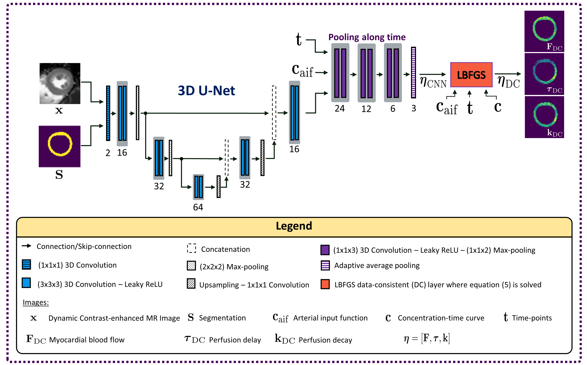
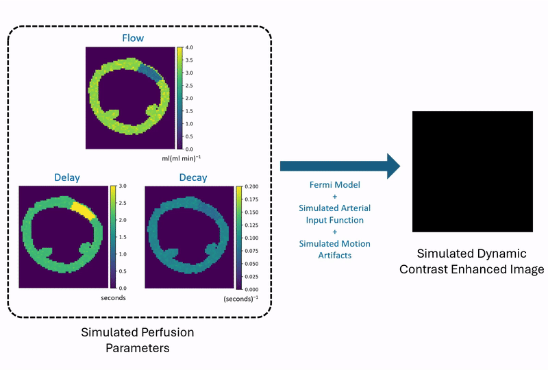

# DeepFermi
A self-supervised deep learning framework that integrates the Fermi model for fast, accurate, robust, and data-consistent myocardial quantification. For more detailed information, please refer to our publication, 'Robust Myocardial Perfusion MRI Quantification with DeepFermi,' which outlines the methodology and validation of the DeepFermi framework.

[Publication](https://ieeexplore.ieee.org/document/10731565) | [Citation](#bibtex-citation)

https://github.com/user-attachments/assets/0f04b6d3-ca0a-4f88-a6e6-d98361f9ed24

**Contribution**: Sherine Brahma, Andreas Kofler, Felix F. Zimmermann, Tobias Schaeffter, Amedeo Chiribiri, and Christoph Kolbitsch.

## Network Architecture

<div align="center">
  
</div>

# Installation

## 1. Clone the repository
Clone the repository and create a new Python environment with Python 3.8 (e.g. using conda):
```
git clone https://github.com/SherineBrahma/deepfermi.git
conda create -n deepfermi python=3.8
conda activate deepfermi
```

## 2. Install DeepFermi and dependencies
Install DeepFermi in editable mode along with necessary tools for linting, testing, and post-install setup:
``` 
pip install -e ".[lint,test]"
sh post_install/post_install.sh
```

# Usage

## Simulated DCE Perfusion Data Generation
Before proceeding with training or testing, you first need to generate the DCE perfusion data. This can be done by running the ```data_generation.py``` script using the XCAT phantom file provided:

```
python src/deepfermi/data_generation.py
```

This will create a DCE perfusion dataset ```dce_perfusion_data.npz``` in the data folder. You can customize the relevant parameters for generating data in ```data_generation.py```.

<div align="center">
  
</div>

Note: Only five cardiac slices are provided in this repository for training, validation, and testing.

## Pre-Trained Model
If you would like to test a pre-trained network (without training it yourself), you can directly run the following command:
```
sh script/test_job_queue.sh
```
This script will:

1. Load the pre-trained model.
2. Test the model in two scenarios:
   * With motion artifacts.
   * Without motion artifacts.
3. Generate the required output arrays.

After testing, you can analyze the output arrays in different ways:

  *  Visualize the results by running:
```
 python src/deepfermi/analysis/generate_img.py
```

<div align="center">
  
</div>

  *  Evaluate performance metrics by running:
```
 python src/deepfermi/analysis/evaluate_measures.py
```
You can also write your scripts to analyze the arrays.

## Train DeepFermi from Scratch
If you would prefer to train the network from scratch, you can do so after generating the data by running:

```
sh script/train_job_queue.sh
```
After training the model, you can proceed with testing it. However, keep in mind that the training data provided in this repository is quite small and intended primarily for code demonstration purposes, so the model's performance might not be optimal.

# Contribution

## How to Contribute
1. Fork the repo and create a new branch.
2. Make changes and test them locally.
3. Submit a pull request with your changes.

## Pre-commit Hooks (Optional)
To automatically run linting before each commit, run:

```
pip install pre-commit
pre-commit install
```

## Running Tests
Run tests before submitting a pull request:
```
pytest  
```

## Issues and Feedback
If you encounter any issues, feel free to open an issue on GitHub.

# Citation

<a id="bibtex-citation"></a>

If you would like to cite this work, here is the BibTeX entry:

```bibtex
@article{brahma2024robust,
  title={Robust Myocardial Perfusion MRI Quantification with DeepFermi},
  author={Brahma, Sherine and Kofler, Andreas and Zimmermann, Felix F and Schaeffter, Tobias and Chiribiri, Amedeo and Kolbitsch, Christoph},
  journal={IEEE Transactions on Biomedical Engineering},
  year={2024},
  publisher={IEEE}
}
```
